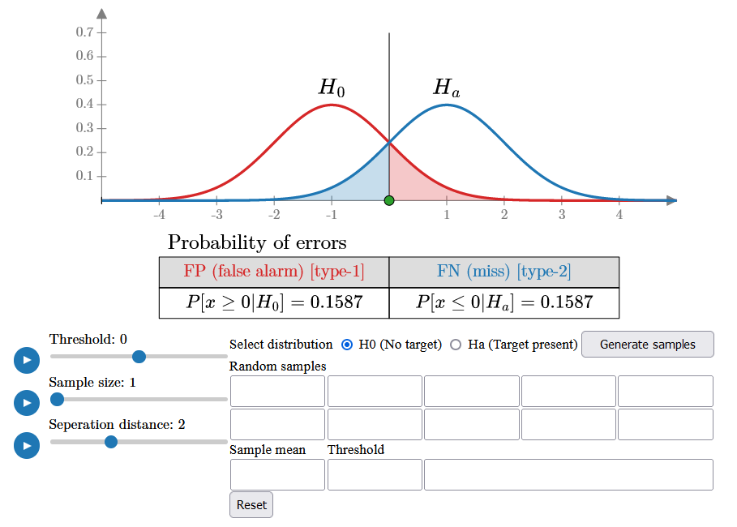
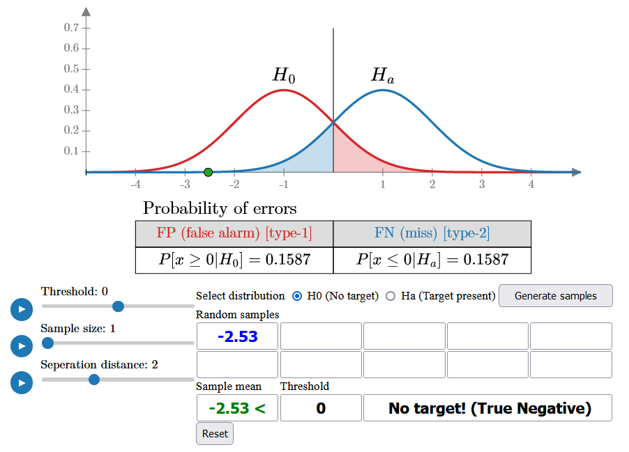
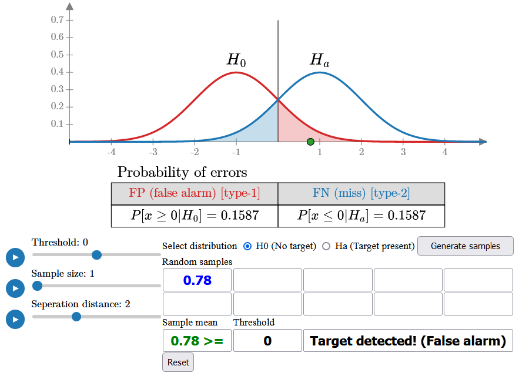
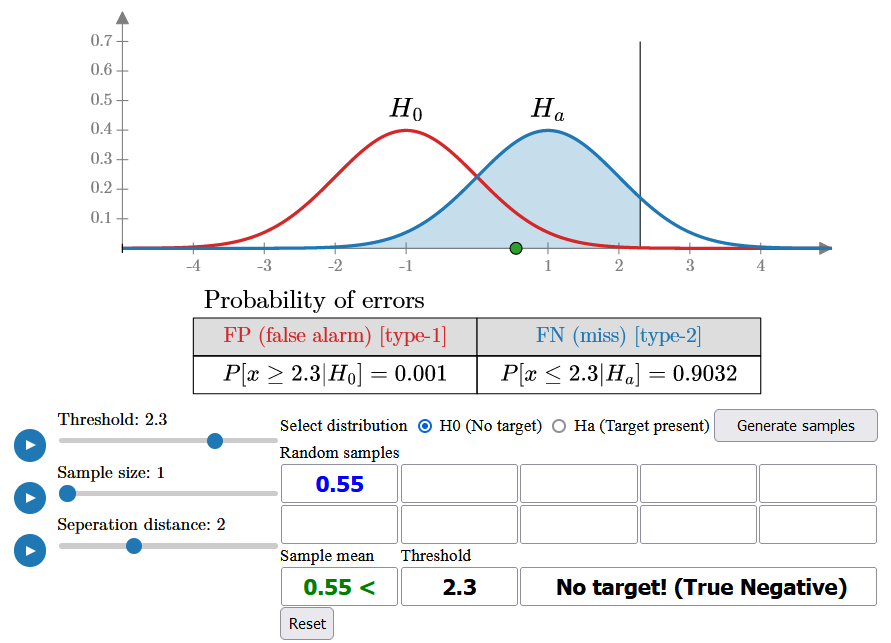
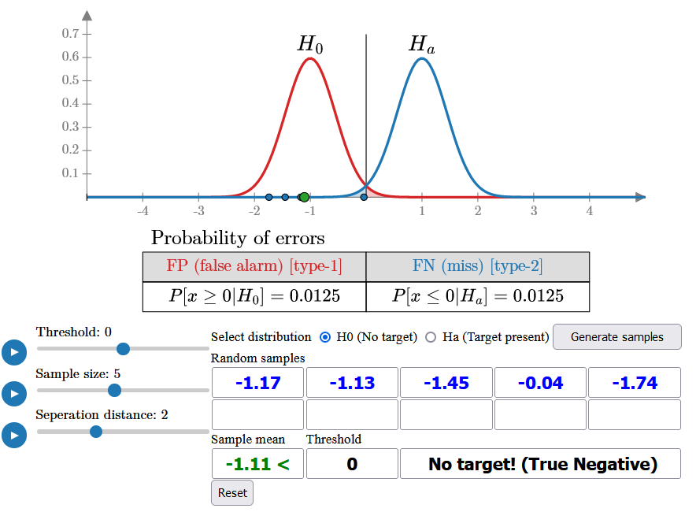
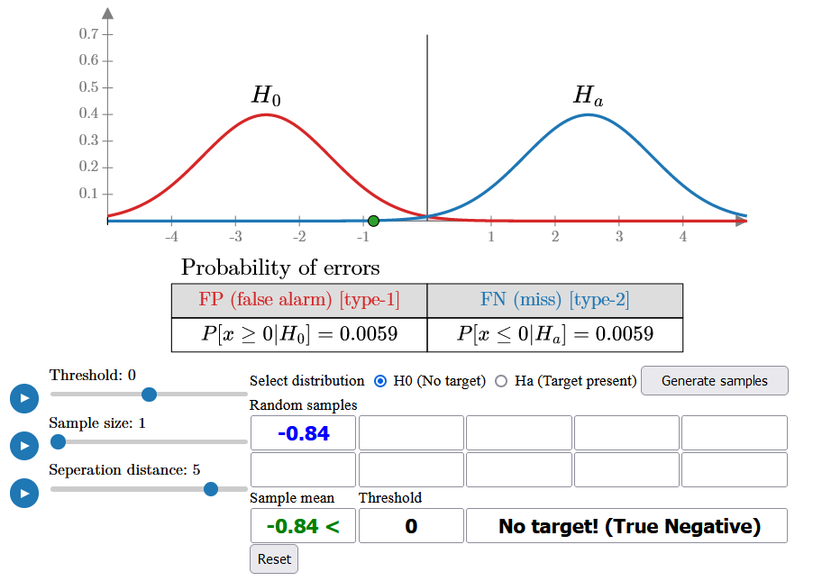

# interactive-hypothesis-testing
 A sandbox for playing around with hypothesis testing and binary detection.

 - Go to [GitHub Page](https://eminucer.github.io/interactive-hypothesis-testing/hypothesis_testing.html) to start playing.

 You can play around with different parameters and see how they would effect the sample distributions and detection accuracy.

 

 The sample distributions for H0 and Ha are shown at the top, with the detection threshold initially set to 0. The false alarm and miss error probabilities are represented by red and blue shaded areas under the curves, along with their respective values.

 You can choose a distribution assuming either the presence or absence of a target and begin generating random samples from it. The detection rule is to calculate the sample mean and compare it to the threshold: if the sample mean is below the threshold, you declare `No Target`, otherwise, you declare `Target`.

 

 For example, since the false alarm probability is initially quite high (15.87%), you will likely see some samples fall on the right side of the threshold as you generate more. These samples, despite being generated under H0, will be classified as a target because they exceed the threshold, resulting in false alarms.

 

 You can shift the threshold to the right (e.g., 2.3) to reduce the false alarm rate, but this will increase the miss error probability (blue area). With the new threshold, as you generate samples under H0, you'll almost never declare a target, resulting in a false alarm rate of less than 1%. However, if you switch to the Ha distribution (assuming there is a target), you will miss most of the targets, as the same threshold will now lead to a higher probability of missed detections.

 

 One way to reduce error is by increasing the sample size (e.g., to 5) and using the sample mean for detection. This decreases the variance of both distributions, lowering the error probabilities to 1.25%. With this approach, you can now generate samples from either distribution and make an accurate detection 98.75% of the time.

 

 Alternatively, the system can be designed with sufficient gain to further separate the distributions. While this may not always be feasible due to system noise, it can significantly reduce error probabilities, making even a single sample sufficient for accurate detection.
 
 

